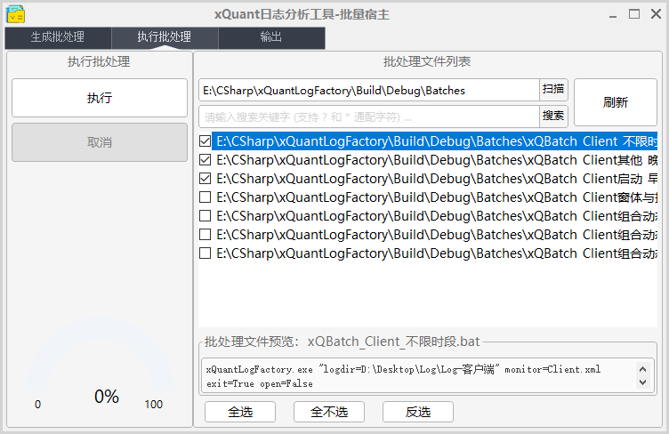

# 日志分析工具

> - author: Leon
>
> - date: 2018/12/14
>
> - last-edit: 2019/5/15
>
> - tips: 文档内部分图形需要使用 Typora
>
> - github: [https://github.com/CuteLeon/LogFactory](https://github.com/CuteLeon/LogFactory)
>
> - release: [https://github.com/CuteLeon/LogFactory/releases](https://github.com/CuteLeon/LogFactory/releases)
---

[TOC]

## 1.项目介绍

​	日志分析工具（下称分析工具），是内部为挖掘系统日志内深层信息而研发的日志分析工具，旨在通过日志文件暴露出系统运行中出现的性能问题。

​	分析工具业务流程大致如下：

1. 根据参数创建分析任务；
2. 解析日志文件为解析结果；
3. 匹配解析结果成组，完整的解析结果组即为分析结果；
4. 导出分析结果到表格和数据透视图；

## 2.项目架构	


| 路径                                        | 角色             | 说明                                    |
| :------------------------------------------ | ---------------- | --------------------------------------- |
| *..\BIZ*\\**Analysiser**                    | 日志分析器       | 分析日志监视结果                        |
| *..\BIZ\Analysiser*\\**DirectedAnalysiser** | 定向分析器       | 深入提取监视结果内日志内容包含的数据    |
| *..\BIZ\Analysiser*\\**GroupAnalysiser**    | 组分析器         | 将开始和结束监视结果匹配为分析结果      |
| *..\BIZ*\\**Exporter**                      | 导出器           | 日志分析结果导出器                      |
| *..\BIZ*\\**FileFinder**                    | 文件查找器       | 查找指定目录内与任务相关的文件          |
| *..\BIZ*\\**Parser**                        | 日志解析器       | 使用监视规则命中日志文件内容为监视结果  |
| *..\Model*\\**EqualityComparer**            | 实体比较器       | 使用自定义规则分析实体是否指向相同数据  |
| *..\Model*\\**Extensions**                  | 实体扩展         | 实体静态扩展                            |
| *..\Model*\\**Factory**                     | 实体工厂         | 实体工厂                                |
| *..\Model*\\**Fixed**                       | 固定数据         | 枚举或常量                              |
| *..\Model*\\**LogFile**                     | 日志文件         | 日志文件相关实体                        |
| *..\Model*\\**Monitor**                     | 监视规则实体     | 监视规则或容器                          |
| *..\Model*\\**Report**                      | 报告相关实体     | 导出报告相关实体                        |
| *..\Model*\\**Result**                      | 日志处理结果实体 | 日志监视结果、分析结果、Performance结果 |
| *..\\***Monitor**                           | 监视规则配置文件 | 预设监视规则配置XML文件                 |
| *..\\***ReportTemplate**                    | 导出报告模板     | 预设导出报告模板                        |
| *..\\***Utils**                             | 工具集合         | 静态工具、助手                          |

## 3.业务流程

### 3.1.创建任务

​	分析工具创建任务阶段主要负责任务参数对象的创建和附带对象的转义。

- 主要步骤如下：
  - 任务参数转义（具体内容见[任务工厂](#taskFactory)章节）
  - 检查工作目录
  - 反序列化监视规则配置
  - 获取日志文件列表

### 3.2.解析日志文件


​	分析工具将使用系统内实现的多个解析器按照监视规则的配置分别解析客户端日志文件、服务端日志文件、Performance日志文件，并将监视结果统一维护到监视结果池中；

​	具体解析流程：

```flow
parse=>start: 解析开始
generalRegex=>condition: 使用概要正则匹配日志
checkTime=>condition: 验证日志时间范围
giveUp=>operation: 放弃数据
generalError=>subroutine: 记录未解析结果
checkMonitor=>condition: 应用所有监视规则匹配日志内容
monitSuccess=>subroutine: 记录所有监视结果
readToEnd=>condition: 日志文件读取未结束
end=>end

parse->readToEnd
generalRegex(yes)->checkTime
generalRegex(no)->generalError(right)->readToEnd
checkTime(yes)->checkMonitor
checkTime(no)->giveUp
checkMonitor(yes)->monitSuccess->readToEnd
checkMonitor(no)->giveUp
readToEnd(no)->end
readToEnd(yes)->generalRegex
```

### 3.3.分析日志监视结果

​	经由解析步骤得到的结果经过监视规则初步筛选后我们关心的日志数据，但这些数据还需要加工才可以更直观的展示日志的深层信息。

​	分析阶段则是将监视结果使用关键信息进行匹配成组，构成一个完整事件的开始和结束，再对分析结果深度提取日志内容中存在的深层信息；

### 3.4.导出分析结果


​	经由复杂的分析流程，日志文件所隐含的深层数据已经被有序的整理到分析结果树中，导出阶段则是将分析结果树内的分析结果以树结构分表导出，并根据各个自定义表的列导出分析结果附带的深层信息，如内存、缓存信息、账户信息等；

## 4.主要数据实体


### 4.1.TaskArgument


​	任务参数实体，作为任务所有配置、数据的管理者，以此集中存储任务相关相关的所有配置参数、日志文件、监视规则、监视结果、分析结果、系统信息等数据；

​	是一次完整任务的直接体现

### 4.2.TerminalLogFile、PerformanceLogFile


​	日志文件实体，通过泛型继承自 LogFileBase<>。记录任务处理的日志文件信息，如：文件路径、相对路径*(相对于任务配置的日志文件目录)*、日志文件类型、文件创建时间、上次写入时间、关联的监视结果、关联的分析结果、关联的未解析结果、Performance日志结果、关联的分析结果总耗时等；

​	是任务所有延伸结果的数据源；

### 4.3.MonitorContainer


​	监视结果容器实体，每个监视规则配置文件(*.xml)对应一个监视规则容器对象，以此容器实现对监视规则树的管理，包括初始化监视规则树关系、自动填充父子或兄弟监视规则配置、自动继承父级监视规则配置等功能；

​	是监视规则树的根节点；

### 4.4.TerminalMonitorItem、PerformanceMonitorItem

​	监视规则实体，通过泛型继承自 MonitorItemBase<>。允许使用者通过配置严谨的监视规则实现丰富的日志分析需求，是分析工具可定制化的最大体现；

​	可定制属性：开始条件、结束条件、组分析器、定向分析器、是否监视内存消耗、结果输出表名等；

​	可计算属性：所有分析结果总耗时、分析结果平均耗时、监视结果匹配率、监视结果所在树级层深等；

​	可管理数据：关联的监视结果、关联的分析结果等；

​	详细配置教程见[监视规则配置教程](#monitorTutorial)章节；

### 4.5.TerminalMonitorResult、PerformanceMonitorResult


​	监视结果实体，通过泛型继承自 MonitorResultBase<>。即监视结果，日志内容经解析器和监视规则解析后的产品，表示监视规则的开始或结束条件在某行日志内容发生命中，并记录为监视结果；

​	监视结果记录与本次命中相关的监视规则、命中类型、日志文件、所在行号、日志时间、日志内容、客户名称、客户端版本号、IP地址、日志级别、日志内容等信息；

​	是“初级产品”；

### 4.6.TerminalUnparsedResult


​	客户端和服务端未监视结果实体，即未能成为“初级产品”的“次品”，这部分日志无法被解析正则表达式识别而被临时保存，等待分析器回头再次分拣；

​	未分析结果仅记录日志内容、所在日志文件、所在文件行号等基础信息；

​	是无法被解析的日志内容；

### 4.7.AnalysisResultContainer


​	分析结果容器实体，提供分析结果树的建造、扫描和管理功能；

​	分析结果容器提供方法用于将分析结果构建为分析结果树，以此推断分析结果之间的嵌套关系；

- 分析结果树构建条件：
  - 分析结果树结构以监视规则树结构为基础；
  - 分析结果树所有分支节点必须为完整分析结果；
  - 分析结果树的叶子结点可以为不完整分析结果；
  - 分析结果树所有节点的开始日志时间必须包含于其父节点的开始和结束日志时间范围内；
  - 不存在父级节点的完整分析结果或监视规则不忽略残缺的分析结果将会作为第一层节点直接入树；
  - Performance日志分析结果需要IP地址和用户名相同才可以初始化入同一颗树；

​	** 为解决分析结果在监视规则树结构上出现断层而无法正确关联的问题，分析结果树初始化算法使用动态规划算法，确保树构建的每一步都是局部最优解；*

​	** 构建分析结果树时默认禁止残缺的分析结果作为树的第一层节点，以防止大量错误的残缺结果污染分析结果树，但可通过监视规则配置关闭这一策略；*

​	是分析结果树的根节点；

### 4.8.TerminalAnalysisResult、PerformanceAnalysisResult


​	分析结果实体，通过泛型继承自 AnalysisResultBase<>。两个对应的监视结果经组分析器分别作为事件开始和结束组装为一个完整的分析结果，一个分析结果表示一个完整事件的开始和结束；

​	分析结果实体记录事件相关的监视规则、开始监视结果、结束监视结果、所在日志文件、开始所在行号、开始日志时间、开始日志内容、客户名称、客户端版本号、父级分析结果、子级监视结果、事件耗时等信息；

​	最终结果，是分析工具的目标产品；

## 5.功能介绍

### 5.1.<span id="taskFactory">任务工厂</span>


​	分析工具目前提供多种任务创建方式，以下将详细介绍；

#### 5.1.1.命令行任务工厂

​	分析工具作为控制台程序，允许直接传入命令行参数配置任务，可以通过编写批处理文件或通过CMD等方式带参调用分析工具；

​	已公开多个参数以允许使用者配置精细的分析任务，任务参数说明及配置要求如下。

**任务参数说明：**

| 参数名称 | 说明               | 备注     | 格式       | 示例                                         |
| -------- | ------------------ | -------- | ---------- | -------------------------------------------- |
| logdir   | 日志文件存放目录   | **必选** | 绝对路径   | C:\TEST_DIR 或 "C:\TEST DIR"                 |
| monitor  | 监视规则文件名称   | **必选** | 相对路径   | monitor.xml                                  |
| start    | 日志开始时间       | **选填*  | 24小时格式 | "2018-10-01 17:30:00"                        |
| finish   | 日志结束时间       | **选填*  | 24小时格式 | "2018-11-11 08:40:00"                        |
| sysinfo  | 是否记录系统信息   | **选填*  | 默认:false | true 或 false                                |
| cltinfo  | 是否记录客户端信息 | **选填*  | 默认:false | true 或 false                                |
| report   | 导出报告格式       | **选填*  | 默认:excel | excel 或 html 或 word                        |
| level    | 日志文件的等级     | **选填*  | 默认:debug | debug 或 trace 或 info 或 perf 或 message 等 |
| exit     | 自动退出           | **选填*  | 默认:false | true 或 false                                |
| open     | 自动打开报告       | **选填*  | 默认:true  | true 或 false                                |

> 注意：
>
> *参数数据内存在空格时，需要在参数外加英文双引号嵌套起来；*
>
> *perfold 日志等级用于兼容旧版 Performance 日志*


- 命令行参数传入格式：
    - 单个参数格式：参数名称=参数数据

    - 多个参数格式：各个参数之间使用空格分隔

  **示例：**

  ```css
  logdir=D:\Desktop\LogDir "finish=2018-11-11 18:30:00" monitor=client.xml report=excel level=debug
  ```

​	当未传入参数或参数传入出现错误时，会在控制台输出具体的参数错误原因，并弹出GUI任务创建窗口，供使用者使用窗口配置任务参数，详细使用方法见任务工厂章节； 

#### 5.1.2.GUI任务工厂

​	当未传入参数时，将会直接打开GUI任务创建窗口，供使用者使用窗口配置任务参数，以更安全的方式创建任务；

​	当参数传入出现错误时，会在控制台输出具体的参数错误原因并将已有参数传给GUI任务创建窗口，在任务创建窗口继续配置任务参数；

​	*GUI任务工厂截图：*

​	

​	可配置任务参数与命令行任务工厂无异；

### 5.2.解析器


​	解析器是分析工具的初级处理器，负责读取日志文件，并逐行使用所有监视规则匹配日志行，将匹配成功的日志内容记录到监视结果池、匹配失败的日志内容丢弃、而无法解析的内容记录将被记录到未解析结果池中；

​	解析器作为第一级处理单元，会直接接触日志文件，而解析器的输出产品——监视结果又将作为下一级处理单元——分析器的输入原料；

​	因为客户端、服务端、Performance等日志文件内日志格式的差异，而将解析器分别有针对性的实现，以下将具体介绍各种解析器；

#### 5.2.1.客户端日志解析器


​	客户端日志解析器是针对于客户端日志实现的解析器，将针对解析日志内容的客户名称、客户端版本、IP地址等数据；

#### 5.2.2.服务端日志解析器


​	服务端日志解析器是针对于服务端日志实现的解析器，将针对解析日志内容的客户名称、客户端版本等数据；

#### 5.2.3.Performance日志解析器

​	Performance日志解析器用于解析客户端和服务端通过Remoting框架通信时产生的执行日志，将针对解析日志内容的客户端IP、用户代码、请求时间、耗时、请求地址、方法名称、流长度、消息等数据；

​	此解析器会记录两类结果：Performance日志解析结果；Performance日志监视结果；

### 5.3.<span id="analysiser">分析器</span>


​	经由解析器解析出的结果只是监视规则在日志文件内命中的体现，而无法直接得到监视规则所代表的事件的执行数据，想要更加直观地获取日志内蕴藏的深层数据，则需要各个组分析器和定向分析器大显身手；

#### 5.3.1.分析器Host


​	分析器的宿主容器，提供对组分析器、定向分析器的托管和执行功能；

​	通过向分析器Host注入各个组分析器和定向分析器才可以在管理状态下有序调用，发挥各个组分析器和定向分析器的能力；
- 分析器Host分析流程：

```flow
analysis=>start: 分析开始
prepareGroup=>operation: 准备组分析器
prepareDirected=>operation: 准备定向分析器
executeGroup=>operation: 执行所有组分析器
excuteDirected=>operation: 执行所有定向分析器
sortResult=>operation: 对分析结果池排序
buildResultTree=>operation: 构建分析结果树
figureOut=>operation: 清算分析结果
end=>end

analysis->prepareGroup->executeGroup->prepareDirected->excuteDirected->sortResult->buildResultTree->figureOut->end
```

#### 5.3.2.组分析器


​	组分分析器用于将同一监视规则的多个监视结果按照对应关系匹配为完整的分析结果，正如将事件的开始和事件的结束匹配为一个完整的事件；

​	因为日志输出存在同步或异步的区别，因此在早期实现通用同步组分析器后，又有针对性的实现了多个异步组分析器，以应对不同的异步日志对结果匹配多样化的条件；

​	以下将逐一介绍；

##### 5.3.2.1.同步组分析器


​	同步组分析器适用于一般同步输出的日志，且日志不包含用于匹配而分辨的数据，有能力处理绝大多数监视规则的监视结果；

##### 5.3.2.1.1.通用同步组分析器

​	通用同步组分析器是同步组分析器的经典实现，是分析工具最常用的组分析器；

​	通用组分析器分为两类：Terminal 和 Performan，分别处理[客户端和服务端]和[Performance]日志监视结果；

- Terminal通用同步组分析器：

  - 按监视结果的监视规则、**客户名称**、**客户端版本约束**、结果类型，以同步顺序匹配为分析结果；
- Performance通用同步组分析器：
  - 按监视结果的监视规则、**IP地址**、**用户代码**、结果类型，以同步顺序匹配为分析结果；

  

- 通用同步组分析器分析流程：

```flow
analysis=>start: 分析开始
groupType=>condition: 监视结果为结束？否则为开始
checkUnclose=>condition: 是否存在未关闭分析结果
createUnclose=>operation: 创建未关闭分析结果
createClosed=>operation: 创建已关闭分析结果
buildAndClose=>operation: 组装完整分析结果并关闭
readToEnd=>condition: 遍历监视结果未结束
end=>end

analysis->readToEnd
groupType(no)->createUnclose->readToEnd
groupType(yes)->checkUnclose
checkUnclose(yes)->buildAndClose(left)->readToEnd
checkUnclose(no)->createClosed->readToEnd
readToEnd(no)->end
readToEnd(yes)->groupType
```

- 结果匹配条件：
  - 相同监视规则；
  - 不同匹配类型 (开始或结束)；
  - 相同客户端版本号；
  - 相同客户名称；
  - 开始结果日志时间不晚于结束结果日志时间；

##### 5.3.2.1.3.通用自封闭组分析器

​	存在某些监视规则天生只存在开始条件，而不存在结束条件，如“内存消耗”监视规则，对于这类监视规则无需使用开始结果和结束结果匹配为完整分析结果，只需使用单一的监视结果构建为一个完整的分析结果；

​	通用自封闭组分析器即为实现上述场景而设计；

##### 5.3.2.2.异步组分析器

​	针对有概率异步输出的日志监视结果，可能出现同一监视规则的开始和结束结果出现嵌套或者穿插，使用通用同步组分析器将导致监视结果匹配出现错误；

​	异步组分析器将会以字典作为未关闭分析结果的寄存器，并深入分析监视结果日志内容的数据，以此为键同时维护多个未关闭分析结果，最终实现异步日志监视结果按对应关系正确匹配为完整分析结果；

##### 5.3.2.2.1.Core服务异步组分析器

​	Core服务日志为异步输出，日志内容中会附带服务名称和服务执行序号，Core服务异步组分析器将通过分析日志内容中附带信息寻找匹配的监视结果组装为完整的分析结果。

- 匹配条件：
  - 相同监视规则；
  - 相同Core服务名称；
  - 相同Core服务执行序号；
- 附带能力：
  - 分析Core服务名称；
  - 分析Core服务执行序号；
  - 分析Core服务每次执行耗时；
  - 分析Core服务是否为触发执行；

##### 5.3.2.2.2.窗体异步组分析器

​	窗体打开日志有概率出现异步异步输出，日志内容中会附带模块代码和窗体名称，窗体异步组分析器将通过分析日志内容中附带信息寻找匹配的监视结果组装为完整的分析结果。

- 匹配条件：
  - 相同监视规则；
  - 相同模块代码；
  - 相同窗体名称；

- 附带能力：
  - 分析模块代码；
  - 分析窗体名称；


##### 5.3.2.2.3.报表异步组分析器

​	报表查询日志有概率出现异步输出，日志内容中会附带报表名称、报表代码和查询参数，报表异步组分析器将通过分析日志内容中附带信息寻找匹配的监视结果组装为完整的分析结果。

- 匹配条件：
  - 相同监视规则；
  - 相同报表名称；
  - 相同报表代码；

- 附带能力：
  - 分析报表名称；
  - 分析报表代码；
  - 分析查询参数；


##### 5.3.2.2.4.限额检查异步组分析器

​	限额检查异步组分析器用于匹配每次限额检查事项的多条日志信息为一个完成分析结果。

​	与大部分事项不同的是：一次限额检查事项的信息会分成多条日志输出，且日志信息条数并不固定，但每条日志都包含与此次事项相关联的信息用于匹配关联。

- 匹配条件：
  - 相同监视规则；
  - 相同用户代码；
  - 相同会话ID；

#### 5.3.3定向分析器

​	通过组分析将监视结果组装为完整的分析结果后，还远远未达到我们的目标，因为很多日志内容中还包含键值对等格式的数据等待发掘，而不同格式的数据又需要不同的算法进行分析，现在就是定向分析器大展身手的时候了！

​	定向分析器将会针对监视规则的所有监视结果或分析结果的日志内容进行深度的发掘，提取更加丰富的数据以键值对的形式存入字典或直接为监视规则新建子级监视规则并重新分配监视结果和分析结果；

##### 5.3.3.1.通用前缀定向分析器

​	通用前缀定向分析器用于处理相同监视规则的监视结果中日志内容以监视规则的开始条件或固定的字符串为开始的日志结果；

​	通用前缀定向分析器将为处理的监视规则创建子监视规则，并将监视结果和分析结果重新分配给子监视规则；

- 适用场景：

  - 日志内容以监视规则的开始条件或固定的字符串为开始；

##### 5.3.3.2.通用内存定向分析器

​	通用内存定向分析器用于处理开启了内存监视功能的监视规则的日志结果；

​	通用内存定向分析器将会深入分析日志内容中的内存消耗数据，并将数据存储到分析结果；

- 适用场景：
  - 日志内容包含内存消耗数据；

##### 5.3.3.3.通用加载定向分析器

​	通用加载定向分析器将会处理加载资源所输出的日志，这类日志一般格式为“^加载.+?：\d+$”，日志内容包含资源名称和耗时；

​	通用加载定向分析器将为处理的监视规则创建子监视规则，并将监视结果和分析结果重新分配为子监视规则；

- 适用场景
  - 日志内容格式如“^加载.+?：\d+$”；

##### 5.3.3.4.通用键值对定向分析器

​	通用键值对定向分析器将会处理日志内容包含键值对数据的日志结果；键值对数据格式为“^.\*?\\[(.+?=.\*?)+\\].\*?$”；

- 适用场景
  - 键值对数据格式如“^.\*?\\[(.+?=.\*?)+\\].\*?$”；

##### 5.3.3.5.缓存数量定向分析器

​	缓存数量定向分析器用于处理无法被监视规则准确命中的缓存数量统计日志（这部分日志被记录在日志文件的未监视结果池中），通过重新分拣未解析日志数据，分析缓存数量为对应的监视规则新建子监视规则，同时讲缓存数量分析结果分配给子监视规则；

- 适用场景

  - 功能针对性较强，难以通用

##### 5.3.3.6.SQL定向分析器

​	SQL定向分析器用于分析SQL语句执行的性能问题；

​	SQL日志中包含SQL语句的哈希值而非SQL语句，以减小SQL日志的体积，SQL语句与哈希的额关系记录在CSV文件中，此分析器会在SQL日志分析后解析此CSV文件；

​	可以配置SQL哈希与描述文本的对应关系，导出图表报告时将优先显示SQL的描述文本，不存在描述文本时输出SQL哈希，配置方式：**./ReportTemplet/SQLHash.xml**

```xml
<SQLHash Hash="SQL哈希" Description="描述文本"/>
```

##### 5.3.3.7.批量审批定向分析器

​	批量审批定向分析器用于分析批量审批日志及操作人的 用户代码；

#### 5.3.4.特殊功能分析器

##### 5.3.4.1.性能指标分析器

​	性能指标分析器用于获取配置了性能指标的监视规则的超额分析结果，将性能数据超过了指标的分析结果导出到图表报告。

### 5.4.导出器

​	将任务信息及日志解析、分析结果导出到外部文件；

#### 5.4.1.Excel导出器

​	将任务所有日志结果分表导出到Excel文件；

> 因 Office2010 限制，单张 Sheet 最大数据量为 1048576，若表名相同的数据数量超过此限制时将会克隆此表继续导出，但默认的数据透视表只能分析第一张表的数据，所以仍然不建议一次性分析过量的日志。
>
> 建议：Performance 和 SQL 日志单次分析日志文件大小在200MB以内；其他日志单次分析日志受监视规则密度的影响可以超过200MB；

#### 5.4.2.HTML导出器

​	将任务所有日志结果导出到HTML文件；


#### 5.4.3.Word导出器

​	**暂未开发 ...*

#### 5.4.4.图表报告导出器

​	使用 Bootstrap 和 Charts.js 等前端框架导出使用业务逻辑分析的性能问题和数据图表到 HTML 文档；

​	包含内存时序折线图、缓存数量时序折线图、客户端与中间件启动耗时分析报告、SQL执行性能排行榜、Performance执行性能排行榜。

> 图表报告单独导出，不受Excel等其他报告影响；

## 6.<span id="monitorTutorial">监视规则配置教程</span>

​	分析工具所使用的配置文件为XML文件，经由分析工具反序列化为配置规则对象，用于日志文件解析。

​	以下将详细介绍监视规文件的配置教程。

### 6.1.监视规则文件结构

​	监视规则XML节点分为三类：
- 第一类为监视规则容器节点：
  - 节点名称为：**MonitorRoot**；
  - 可以拥有Name属性以指定监视规则容器对象的名称（可省略）；
  - 每个XML配置文件必须以监视规则容器节点为**根级**节点；
  - 所有监视规则节点必须**包含**在根级监视规则容器节点内（可以嵌套包含）;
  - 每个XML配置文件仅允许包含**一个**监视规则容器节点；
- 第二类为客户端和服务端监视规则节点：
  - 节点名称为：**Item**
  - 监视规则拥有丰富的属性供使用者配置，以实现复杂的日志文件解析逻辑；
  - 每个监视规则节点可以 **嵌套** **多个** **同类** 子级监视规则节点（每个节点的**直接**子级节点**不超过9999个**）；
- 第三类为Performan监视规则节点：
  - 节点名称为：**Perf**
  - 此类监视规则可配置项较**Item**规则更少，不允许分表导出、内存监视、指定组分析器和定向分析器等；
  - 每个监视规则节点可以 **嵌套** **多个** **同类** 子级监视规则节点（每个节点的**直接**子级节点**不超过9999个**）；

### 6.2.监视规则可配置属性

- 监视规则可配置属性：

  | 属性名称           | 说明                 | 类型                                |
  | ------------------ | -------------------- | ----------------------------------- |
  | Name               | 监视规则名称         | string                              |
  | Begin              | 事件开始条件         | string                              |
  | End                | 事件结束条件         | string                              |
  | GroupAnalysiser    | 组分析器             | **TerminalGroupAnalysiserTypes**    |
  | DirectedAnalysiser | 定向分析器           | **TerminalDirectedAnalysiserTypes** |
  | Memory             | 内存分析开关         | bool                                |
  | IgnoreUnIntactRoot | 忽略根级残缺分析结果 | bool                                |
  | Sheet              | 导出表名             | string                              |
  | Quota              | 性能指标             | int                                 |

- Name

  - 必须；

  - 用于区别各个监视规则；

- Begin

  - 必须；
  - 使用一个事件开始的日志内容中出现的字符串用于识别此日志内容；
  - 应考虑使用仅在目标日志内容出现的**独特**的字符串，以免在不相干的日志内容中出现无用的匹配；

- End

  - 可省略，但当不存在End配置时，监视规则分析结果将只表示事件的开始；
  - 使用一个事件结束的日志内容中出现的字符串用于识别此日志内容；
  - 应考虑使用仅在目标日志内容出现的**独特**的字符串，以免在不相干的日志内容中出现无用的匹配；

- GroupAnalysiser

  - 可省略，默认为 TerminalGroupAnalysiserTypes.Common，使用通用同步组分析器；

  - 可以通过此字段指定此监视规则的监视结果通过何种策略匹配成组，以构建分析结果；

  - 数据类型为自定义类型——TerminalDirectedAnalysiserTypes；

  - 可选值：

    | 配置数据         | ID   | 名称                  | 说明                                               |
    | ---------------- | ---- | --------------------- | -------------------------------------------------- |
    | Common           | 0    | *通用同步分析器*      | 以监视规则、日志时间、监视结果类型匹配监视结果成组 |
    | SelfSealing      | 1    | 自封闭组分析器        | 仅存在开始条件的监视规则的每个监视结果将会独立成组 |
    | CoreServiceAsync | 2    | Core 服务异步组分析器 | 以监视规则、服务名称、执行序号匹配监视结果成组     |
    | FormAsync        | 3    | 窗体异步组分析器      | 以模块代码、窗体名称匹配监视结果成组               |
    | ReportAsync      | 4    | 报表异步组分析器      | 以报表代码、报表名称匹配监视结果成组               |
    | LimitCheckAsync  | 5    | 限额检查异步组分析器  | 以用户代码和会话ID匹配监视结果成组                 |

- DirectedAnalysiser

  - 可省略，默认为 TerminalDirectedAnalysiserTypes.None，不使用任何定向分析器；

  - 可以通过此字段指定此监视规则的分析结果以何种逻辑深入提取日志内容蕴藏的深层信息；

  - 数据类型为自定义类型——TerminalDirectedAnalysiserTypes；

  - 可选值：

    | 配置数据     | ID   | 名称               | 说明                                                         |
    | ------------ | ---- | ------------------ | ------------------------------------------------------------ |
    | None         | 0    | *未指定定向分析器* | 不使用任何定向分析器                                         |
    | Prefix       | 1    | 通用前缀定向分析器 | 以固定字符串为前缀分析日志内容附加数据，并以此数据新建子监视结果、重新分配日志结果到子监视规则 |
    | Load         | 2    | 通用加载定向分析器 | 分析格式如"加载{资源名称}：{耗时}"的日志结果，并提取资源名称和耗时 |
    | KeyValuePair | 3    | 键值对定向分析器   | 分析日志内容内包含中括号且中括号内包含键值对数据的日志结果，并提取键值对数据存入分析结果数据字典； |
    | CacheSize    | 4    | 统计缓存定向分析器 | 分析多行输出的缓存数量统计日志结果，仅用于特殊用途           |

- Memory

  - 可省略，默认为 false，不进行内存分析；
  - 部分日志内容包含内存消耗数据，可通过此开关配置是否对监视规则的日志结果进行内存分析；
  - 可选值：true \ false（小写）；

- IgnoreUnIntactRoot

  - 可省略，默认为 true，构建分析结果树时忽略残缺的根级分析结果入树；
  - 部分监视规则允许将残缺的分析结果入分析结果树，通过此配置控制；
  - 可选值：true \ false（小写）；

- Sheet

  - 可省略，默认为“原始”表；
  - 配置监视规则及其子规则的日志结果导出的数据表名称；
  - **未配置表名的子节点会继承父节点的表名配置；**
  - 若配置了模板中不存在的表名，工具将自动克隆“原始”表创建目标表名的Sheet表；

- Quota

  - 可省略，默认为 int.MinValue；
  - 配置监视规则的性能指标，以快速筛选性能数据超过此指标的分析结果；
  - 可选值：{int}；

### 6.3.精简自动填充开始条件

​	为简化使用者配置监视规则的步骤，使用者可以精简地配置监视规则文件，分析工具将会自动补全监视规则文件精简的信息；

- 已经支持的精简写法：

  - 第一个子节点不存在开始条件时，将会自动补全为**父节点的开始条件**

    如：

    ```xml
    <Item Name="父节点" Begin="父节点开始条件" End="..." Sheet="...">
      <Item Name="子节点" Begin="" End="..."/>
    </Item>
    ```

    效果等同于：

    ```xml
    <Item Name="父节点" Begin="父节点开始条件" End="..." Sheet="...">
      <Item Name="子节点" Begin="父节点开始条件" End="..."/>
    </Item>
    ```

  - 后一个兄弟节点不存在开始条件时，将会自动补全为**前一个兄弟节点*(如果存在)*的结束条件**

    如：

    ```xml
    <Item Name="前一个兄弟节点" Begin="..." End="前一个兄弟节点的结束条件">
    <Item Name="后一个兄弟节点" Begin="" End="..."/>
    ```

    效果等同于：

    ```xml
    <Item Name="前一个兄弟节点" Begin="..." End="前一个兄弟节点的结束条件">
    <Item Name="后一个兄弟节点" Begin="前一个兄弟节点的结束条件" End="..."/>
    ```

### 6.4.组分析器与定向分析器

​	遇到需要特殊处理的日志结果，以通过配置分析工具已支持的组分析器或定向分析器实现复杂的分析逻辑，各个组分析器与定向分析器的使用场景可见上文[分析器](#analysiser)章节；

- 对于工作中遇到的需要自定义逻辑的日志数据，而分析工具尚未实现对应的分析器时：
  - 请访问此分析工具的GitHub仓库：[`https://github.com/CuteLeon/LogFactory`](https://github.com/CuteLeon/LogFactory)

## 7.批量执行工具

### 7.1.概述

​	在分析工具使用期间，我们经常遇到日志文件数量、监视规则配置数量或日志时间跨度过大的问题，为了减轻分析工具的性能负担，往往需要我们手动拆分文件或手写小颗粒任务的批处理脚本以减小任务处理的压力，但是往往这种人工工作会更容易造成倦怠感和更低的生产效率。因此，日志分析工具-批量执行工具的开发可以大幅提高大数据量日志分析任务的效率。

### 7.2.功能介绍

​	此工具第一版本研发历经两天，已经包含较为完备的批量生成脚本、批量执行脚本、脚本执行信息重定向功能。

- 此工具业务流程主要为以下：
  - 根据任务配置自动生成一个或多个(小粒度)的任务脚本；
  - 批量执行选定的任务脚本；
  - 托管控制台输入输出流，显示分析工具运行进度，或进行交互；

#### 7.2.1.批量生成脚本

​	此功能用于按监视规则和日志时间等条件将任务分解为小任务并批量导出为批处理脚本，界面见下图：


- 界面主要分为三部分：
  - 左方为任务基本信息和任务划分条件配置区域，用于创建和划分任务；
  - 右方为监视规则文件勾选区域，用于勾选需要使用的监视规则文件；
  - 下方为控制区域，用于设置批处理脚本生成目录，并启动生成任务；

- 需要注意：

  - 任务配置区域包含两个特殊配置字段：分隔任务时段 & 分隔时段单位：

    当任务配置了日志的开始和结束时段后，可以通过这两个字段将任务以时间段划分为多个子任务；

    - 仅当任务同时配置日志开始时间和结束时间才可以启用此功能；
    - 设置分隔时段数量和单位，会将任务时段以此时段长度划分为多个子时段的任务并独立导出；
    - 可选单位时间为：天、小时、分钟；

  - 预计生成批处理文件数量：

    显示当前配置下预计生成的批处理文件数量

    - 计算方式：时段数量 * 监视规则数量
    - 未配置任务时段或仅配置日志的开始或结束时间之一，认为时段数量为1；

#### 7.2.2.批量执行脚本

​	此工具用于扫描、筛选并执行批处理脚本文件，界面见下图：



- 界面主要分为两部分：
  - 左方为执行控制和进度显示区域：

    - 上方为批处理脚本执行和取消控制按钮；
    - 下方为执行进度仪表盘；

  - 右方批处理文件扫描和筛选区域：

    - 用户可在扫描输入框选择批处理文件存放目录，目录内BAT文件将被显示在下方勾选列表框内；
    - 用户可在搜索输入框输入搜索条件对文件路径进行搜索，此功能支持通配字符：
      - ? 表示一个任意字符
      - \* 表示任意多个任意字符
    - 用户可在勾选列表框内勾选需要执行的批处理文件，或使用下方的选择按钮，批量选择；


#### 7.2.3.控制台信息重定向

​	此功能用于托管分析工具的输入输出流，将控制台窗口输出的消息实时显示在批量执行工具界面内，并允许用户向控制台窗口发送数据，界面见下图：


- 需要注意：

  - 如果分析任务启用了自动退出功能，则批处理脚本会在分析任务结束后自动关闭，并执行下一个批处理脚本，用户无需任何手动干预；
  - 如果分析任务未启动自动退出功能，则此批处理脚本在运行结束后，将会等待用户输入任意字符后才会关闭，而用户输入之前，批处理执行作业则会被一直阻塞，因此需要注意此处，当控制太输出信息显示等待用户输入时，可以通过此界面下方的`发送`和`发送回车`按钮向控制台窗口发送数据；

### 7.3.使用问题的说明：

#### 7.3.1.任务线程回调导致界面延迟

​	使用此工具时有可能遇到以下情况：点击任务启动或取消按钮后，按钮被置灰，而任务界面却迟迟未切换，这是因为操作安全考虑：

- 工具使用线程池回调技术，复杂任务由线程池回调后托管执行，因此可能存在延时情况，而延时期间任务已经进入线程池等待队列等待执行；
- 延迟切换界面，可以使界面更准确的传达任务执行的状态给用户；
- 将按钮置灰是为防止等待线程池回调期间重复触发操作；

#### 7.3.2.手动执行脚本需要CD至工具可执行程序目录

​	此工具将把批处理脚本生成到分析工具所在目录的自己目录，而脚本中并未使用 `..\` 修改程序相对路径，如果用户需要手动调用这些脚本，需要注意CMD的工作目录或脚本与可执行程序的相对路径；

## 8.Excel数据透视表教程

​	经分析工具导出分析结果到Excel后，可以通过Excel强大的数据透视表功能帮助我们快速实现分析结果的可视化，通过配置数据透视表，将我们关心的数据更直观的展示出来。

### 8.1.一般数据透视表

​	通常，我们拿到一张分析结果Sheet后，还需要更细致地从不同维度分析这些数据，以Performance日志分析结果为例，如下图，我们打开一张分析工具导出的报告Sheet，可以我们关心的是：某个IP对某个方法调用次数，应该入股使用数据透视表将数据更直观的显示出来呢？


​	首先，当然是Ctrl+A全选这些数据，而后点击Excel【插入】选项卡的【数据透视表】，快速的创建出一张数据透视表。如下图。


​	如下配置数据透视表字段：

- 筛选：
  - 筛选字段将会在透视图上方生成一个可勾选下拉框，适用于区分大维度数据；
- 列：
  - 每个列字段将横向生成一列数据；
- 行：
  - 每个行字段将竖向生成一行数据；
- 值：
  - 数据列允许自定义计算规则，并显示计算结果，适用于处理我们关心的数据；


​	经过以上配置，我们可以得到一张如下所示的数据透视图，我们可以清晰的看到不同的IP对"登录"事项的调用次数（最后一列）、平均耗时、最小耗时、最大耗时、耗时总体方差（用于反应耗时是否稳定）等数据；


### 8.2.时间分组数据透视表

​	以上介绍了常见的数据透视图应用场景，但是这种方式还无法满足一些更加复杂的场景，例如需要对时间进行分组...如下图，我们打开一张Performance解析结果Sheet，我们希望得知某个方法在某个时段被某个IP调用的次数，而精确的时间点数据如何转换为时间段数据？


​	加入，我们以“开始时间”列作为时间段分组数据，则需要我们确保此列数据格式为时间格式，可以通过右击此列，选择【设置单元格格式】，将此列数据设置为“时间”格式。


​	此时需要注意：如果此列数据显示为左对齐或后续步骤创建分组时提示“选定区域不能分组”，则说明此列数据格式仍然有误，需要分列调整，分列方式如下：选中时间数据列，点击【数据】选项卡【分列】按钮，在【列数据格式】处选择【日期：[YMD]】，确保【数据预览】处数据格式显示为[YTM]，点击【完成】。


​	此时，数据准备完成，重复前文步骤创建数据透视表，按以下方式配置数据透视图字段，行数据仅勾选“小时”即可，筛选字段增加“日”；


​	得到数据透视图如下：


​	Ctrl+A选中数据透视图所有数据，点击【插入】选项卡【推荐的图表】，选择喜欢的图表样式，即可生成一张方法调用时间分布图表。


​	用户可以通过图表上的多个下拉框控件勾选关心的数据筛选条件，清晰获取不同IP在不同日志对不同方法的调用次数在不同时间的分布情况。

### 8.3.选择适合的监视规则性能指标数据

​	可以为监视规则配置性能指标，并使用指标分析器获取配置了性能指标的监视规则的超额分析结果。

​	以 财务核算监视规则的性能指标选择 为例：

- 使用财务核算分析结果制作数据透视表如下：
  - 
- 双击任一监视规则的耗时统计数据，打开此监视规则的所有分析结果，如“指令核算”；
- 选中“耗时”数据列，点击 插入>图表>XY散点图：
  - 
- 根据散点图选择略高于耗时“众数”的数据作为此监视规则的性能指标即可，此例中 “1000” 便是个不错的选择；

### 8.4.Excel导出模板表命名规范

​	可以在执行日志分析任务之前手动在Excel模板文件中创建和设计所需的Sheet和与其对应的数据透视表，但新表与其对应数据透视表名称规范如下：

- 新表数据透视表名称为：$"{新表名称}-分析{其他后缀}"
  - 例如：
  - “SQL” 表对应 “SQL-分析” 等；
  - “Performance” 表对应 “Performance-分析”、“Performance-分析调用时段” 等；